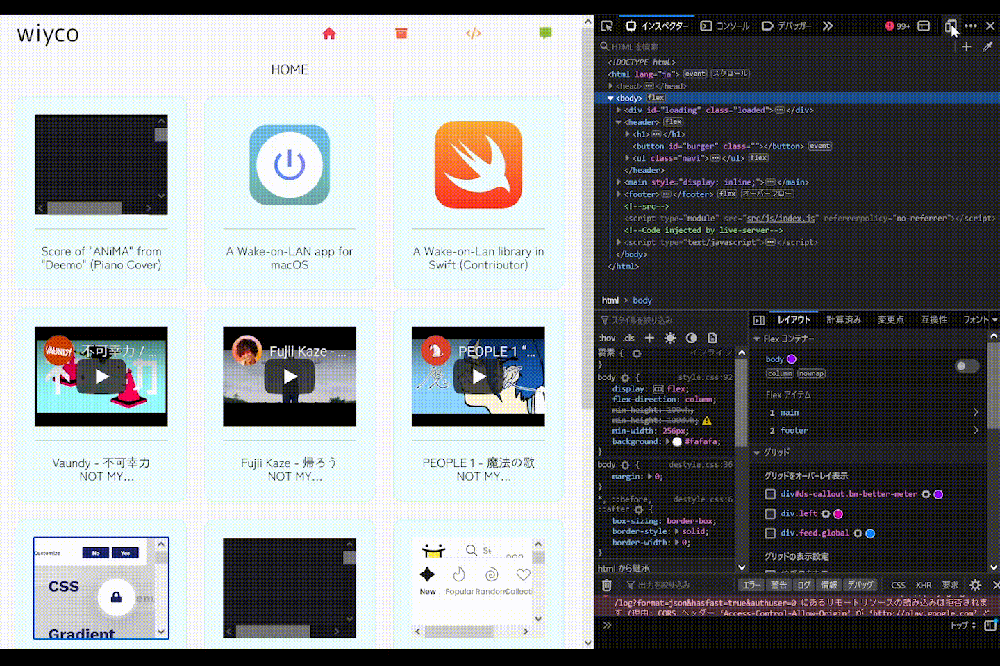

# wiyco
My profile.

## GitHub Pages
### [wiyco.github.io](https://wiyco.github.io/)

## Why I chose...
I chose [Vanilla JS](http://vanilla-js.com/).

I don't want to worry about the performance. (and also built an environment & something complicated things bla bla...)

To who say "You're a fucking idiot" to me, I want to send this word.

#### ***"Simple is the best"***.

Well... Anyway, you can see the benchmark results in [this link](https://krausest.github.io/js-framework-benchmark/current.html).

## Responsive Web Design
"Safari (iOS & macOS)" needs a dummy element before the iframe to fixed aspect ratio.

